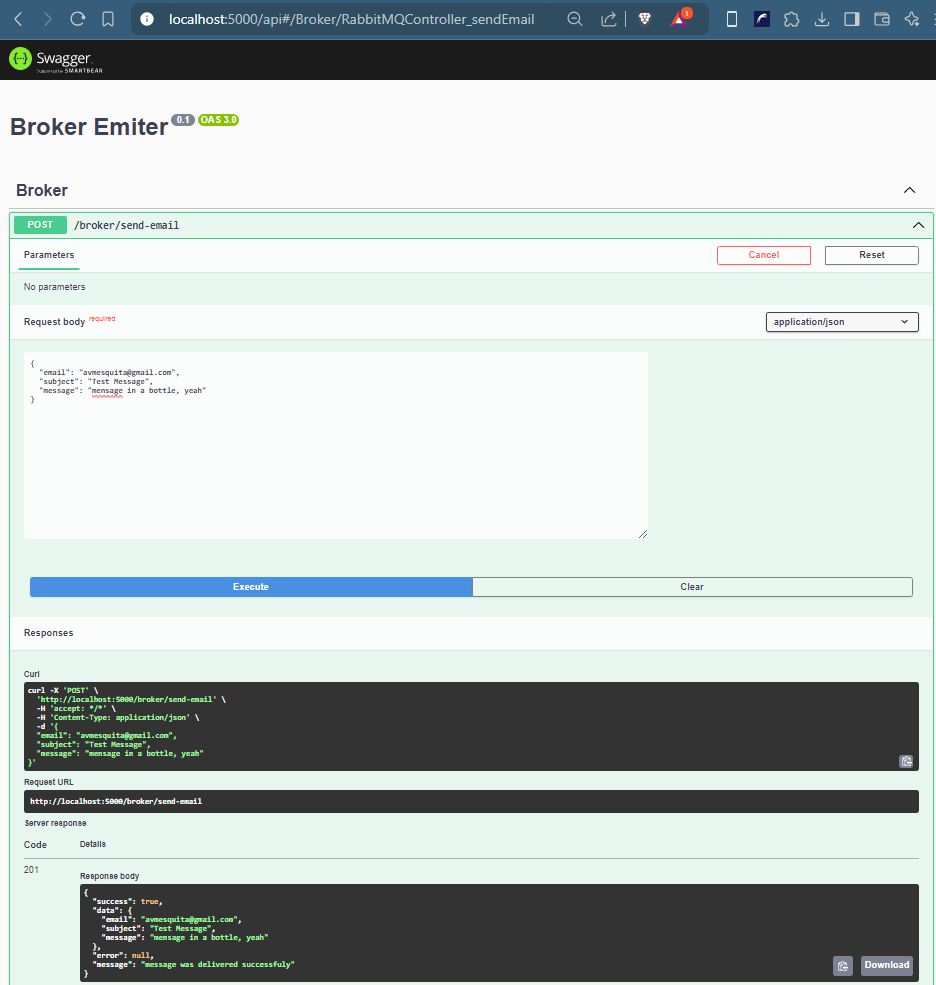
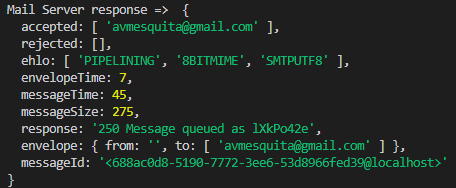
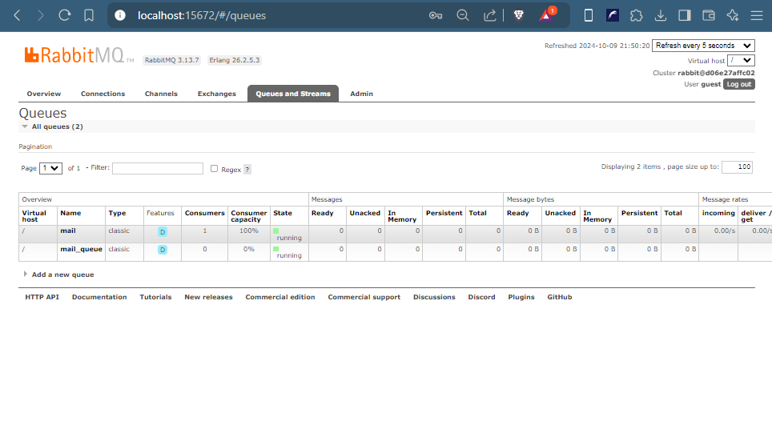
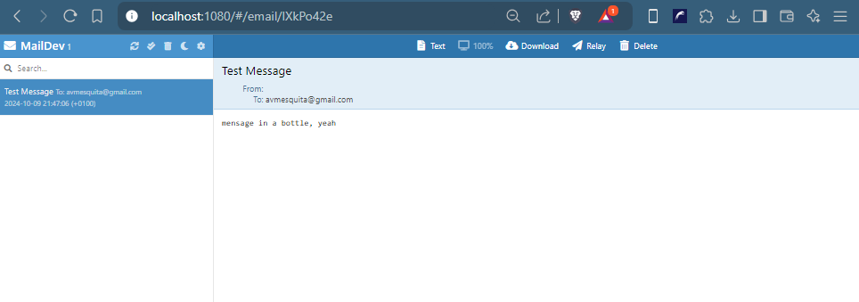

# NestJs Mail Broker


## Concept

Build a broker-type system that consists of a microservice for sending emails to a queue service and another microservice that listens to a message pattern and sends it itself via SMTP so that it can be scaled and the message is not lost if the sending fails.


## Layers

- [RabbitMQ](https://www.rabbitmq.com/)
- [Maildev](https://maildev.github.io/maildev/)
- [Broker Emiter Rest API](broker-emiter/README.md)
- [Broker Consumer](broker-consumer/README.md)


## Build & Publish

```bash
    > git clone https://github.com/avmesquita/nestjs-mail-broker.git
    > cd nestjs-mail-broker
    > docker-compose build --no-cache --pull
    > docker-compose -d up --force-recreate
```


## Development Documentation

- [Broker Emiter Rest API](broker-emiter/documentation/index.html)

- [Broker Consumer](broker-consumer/documentation/index.html)


## Resources









